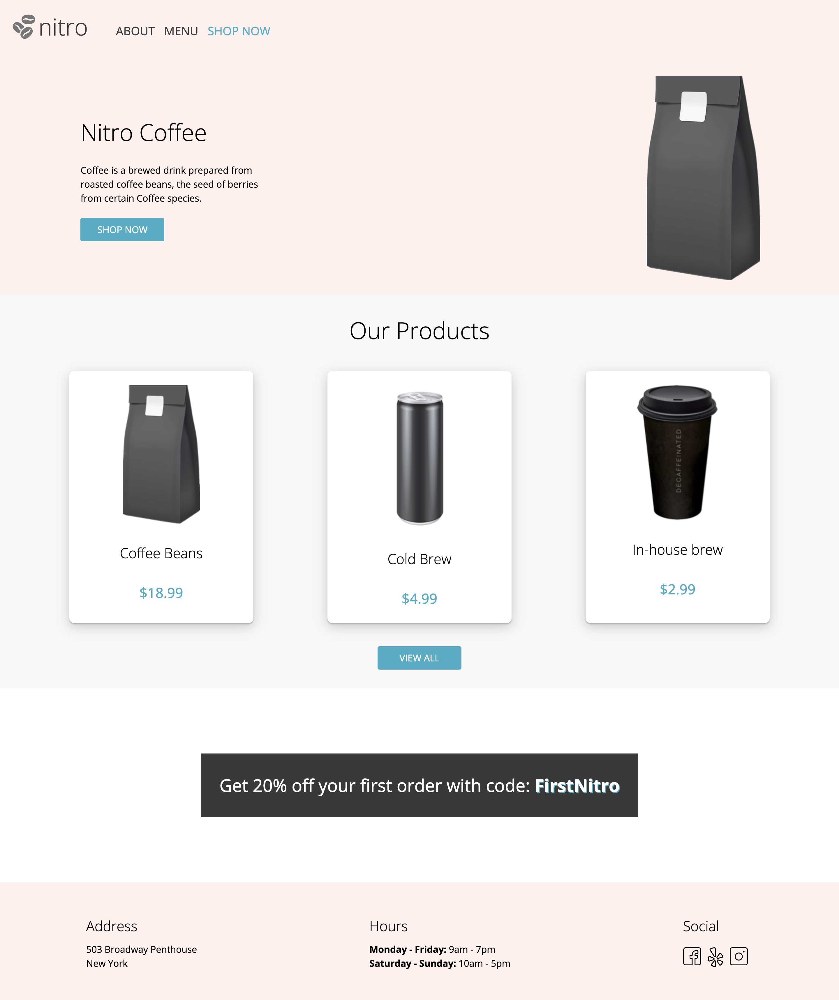
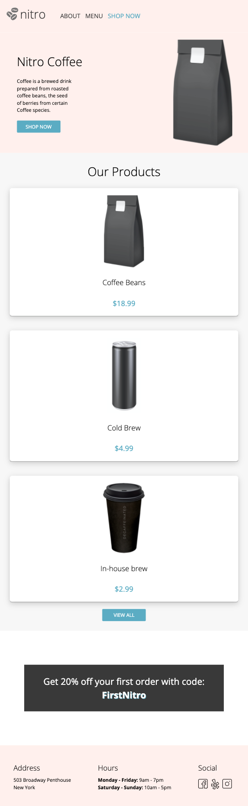
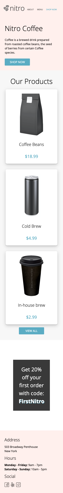
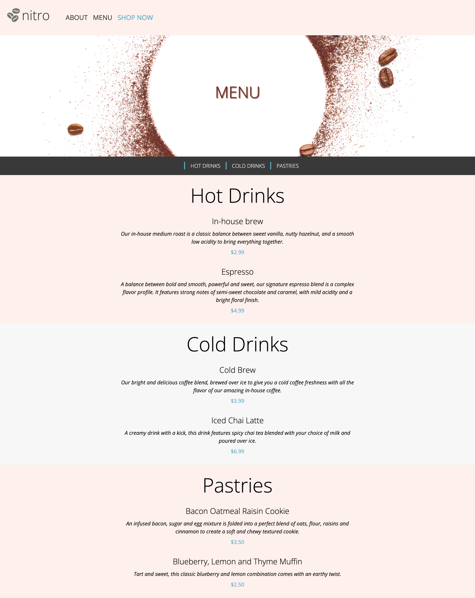
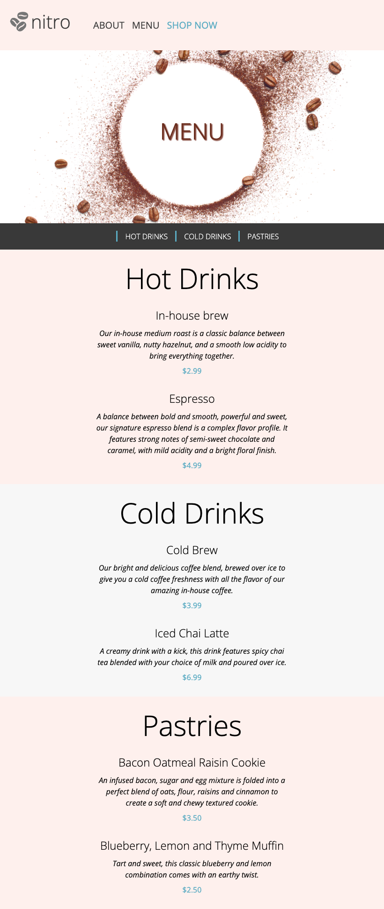

# ☕ Coffee Shop

## Table of contents

- [The Exercise](#the-exercise)
- [Features](#features)
- [Technologies](#built-with)
- [Installing](#installing)
- [Live](#live)
- [Screenshot](#screenshot)
- [Author](#author)

## Overview

### The Exercise
- Build a multi-page website to a new local coffee shop which is set to launch soon.

### Features
- Multi-page website
- Responsive design
- Users can access basic information on landing page
- Users can access further details on menu page

### Technologies

- Semantic HTML5 markup
- CSS custom properties
- FlexBox

### Installing

- Download the Repository
- Open `index.html` on a web browser (*Best support on Google Chrome*)

### Live

- [Coffee Shop](https://aramatsolrac.github.io/BrainStation/coffee_shop/)

### Screenshots

Landing Page

##### Desktop

##### Tablet

##### Mobile

Menu

##### Desktop

##### Tablet

##### Mobile

### Author

- Linkedin - [Tamara Carlos](https://www.linkedin.com/in/tamaracarlos/)
- Twitter - [@aramatsolrac](https://twitter.com/aramatsolrac)

